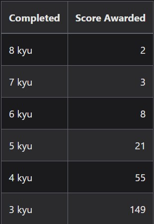

# Pruebas-Tecnicas
*Normalemente redacto la <u>**Documentacion en ingles**</u>. Pero dada la complejidad de algunas pruebas, asi como la mayor facilidad y rapidez de evaluacion de las mismas, esta vez, me he permitido documentar en español.*

 

## *Saltos de pagina:*

- <a href="#ancla-1">Competencias por nivel, puntuaciones, badges y ejercicios</a>
- <a href="#ancla-2">Ver Soluciones a las tecnicas en el repositorio:</a>

 

## Competencias por nivel, puntuaciones, badges y ejercicios resueltos:

 

### Competencias por nivel

[**Pagina oficial codewars. Apartado competencias requeridas para resolver los niveles desde 8kyu hasta el 4kyu**](https://docs.codewars.com/curation/references/kata-ranks/#8-kyu)

 

### Puntuaciones Recibidas por dificultad de Kata
*Presiona ctrl+click sobre la imagen para ver la misma imagen en la pagina de documentacion oficial*

 

##### *No confundir el score con el honor, el honor es el que aparece en la badge y el score el que aparece en la api. El score siempre es mas alto(salvo que ademas de resolver ejercicios te dediques a crearlos) Se consigue menos honor que score por resolver ejercicos del mismo nivel: https://docs.codewars.com/gamification/honor/#solving-kata*

 

[Visualiza mi score en su API](https://www.codewars.com/api/v1/users/PabloMatMar)

 

### Badge
##### Presiona ctrl + click para ver la badge

 

[**Listado de ejercicios completados (184) en su API.**](https://www.codewars.com/api/v1/users/PabloMatMar/code-challenges/completed?page={page})

 

## Ver Soluciones a las pruebas tecnicas en el repositorio:

1. Ves a una de las carpetas donde se especifican los niveles de las pruebas que alli residen.
    - Dificultad: 8kyu < 1kyu
2. Selecciona dentro de la carpeta el script que quieras ver.
    - Su nombre indica el nombre de la prueba original en codewars, cuyo enlace esta al comienzo del script.
3. En el archivo haz click derecho sobre el nombre, selecciona cambiar nombre y en su lugar haz ctrl + c (copiar)
4. Dirigite a index y en el atributo src de la etiqueta script introduce ./(1-8)kyu(carpeta que contiene el archivo)/ y haz ctrl + v justo aqui

5. Corre la direccion http://127.0.0.1:5500/ (Tal vez debas habilitarla antes en tu editor de codigo)

6. En el script encontrarás:
   - Link a la prueba original en codewars.
   - Enunciado de la prueba (Los test pueden requerir mas cosas)
   - Solucion COMPLETA realizada por mi
   - Una llamada a la funcion comentada explicandote el argumento/s que debes pasarle y lo que la funcion devolverá(Un enunciado abreviado)

7. Abre el inspector, llama a la funcion y comprueba que hace lo que se especifica que hace. Presta atencion al argumento requerido.
